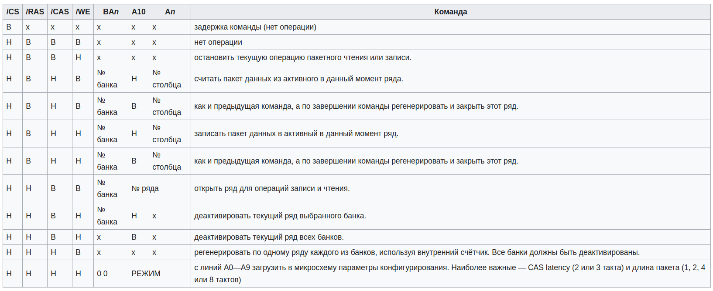

# Техническое задание  

## Требуется разработать 3 устройства, которые будут реализовывать следующие модели

### 1. [Синхронное ОЗУ](#Синхронное-ОЗУ)

### 2. [Асинхронное ОЗУ](#Асинхронное-ОЗУ)

### 3. [Двухпортовое ОЗУ](#Двухпортовое-ОЗУ)

### 4. [Перечатель на встроенный в ПЛИС IP-блок](#Переключатель)

----

## Синхронное ОЗУ

### Описание синхронного ОЗУ

>Синхронное ОЗУ (SDRAM) - ответ на поступивший в устройство управляющий сигнал возвращается не сразу, а при получении следующего тактового сигнала.  
Тактовые сигналы позволяют организовать работу устройства в виде конечного автомата, исполняющего входные команды.

### В общем виде сигналы синхронного ОЗУ выглядят так

----

### Сигналы синхронного ОЗУ

| Сигнал | Тип    | Значение          |
|--------|--------|-------------------|
| Clk    | Input  | Тактовый сигнал   |
| We     | Input  | Разрешение записи |
| Addr   | Input  | Адрес ячейки      |
| D      | Input  | Данные для записи |
| Q      | Output | Данные в ячейке   |

[К началу](#Техническое-задание)

----

## Асинхронное ОЗУ

### Описание асинхронного ОЗУ

>В асинхронной памяти все процессы инициализируются стробами выборки адресов строк и столбцов. Их завершение происходит через определённый для данной микросхемы временной интервал. Втечение всего интервала линия памяти занята, значительная часть времени проходит в ожидании данных

### Сигналы асинхронного ОЗУ

| Сигнал | Тип    | Значение          |
|--------|--------|-------------------|
| We     | Input  | Разрешение записи |
| Addr   | Input  | Адрес ячейки      |
| D      | Input  | Данные для записи |
| Q      | Output | Данные в ячейке   |

[К началу](#Техническое-задание)  

----

## Двухпортовое ОЗУ

### Общая информация об ОЗУ в двухпортовом режиме

>Двухпортовое ОЗУ - это статическое ОЗУ с двумя интерфейсами, обеспечивающими доступ к банкам в пространстве памяти

### Сигналы двухпортового ОЗУ

| Сигнал    | Тип    | Значени           |
|-----------|--------|-------------------|
| Clk       | Input  | Тактовый сигнал   |
| Device    | Input  | Разрешение работы |
| WrAddress | Input  | Адрес записи      |
| RAddress  | Input  | Адрес чтения      |
| WRen      | Input  | Разрешение записи |
| RDen      | Input  | Разрешение чтения |
| Data      | Input  | Входные данные    |
| Q         | Output | Выходные данные   |

[К началу](#Техническое-задание)

----

## Переключатель

### Общая информация об устройстве

> Переключатель должен реализовывать перключение с реализуемого [устройства](#Двухпортовое-ОЗУ) на встроенный в ПЛИС IP-блок и обратно

### Сигналы переключателя

| Сигнал | Тип    | Значение                                                                                  |
|--------|--------|-------------------------------------------------------------------------------------------|
| Type   | Input  | При выском уровне подключется встроенный IP-блок. При низком - разрабатываемое устройство |
| IP     | Output | Разрешение работы IP-блоку                                                                |
| Device | Output | Разрешение работы разрабатываемому устройству                                             |
